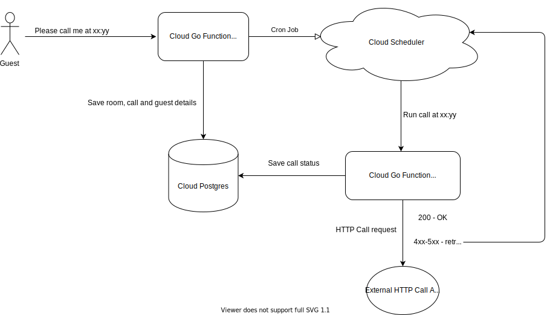

# WakeUp

Hotel wake up service.

Customer asks to wake them up at xx:yy and this what this service does.

Technologies used: Google Cloud Scheduler, Cloud SQL, Cloud Functions.

# Service Diagram


# Deploy

```
macbook:cmd jt$ ./deploy.all.sh
Deploying function (may take a while - up to 2 minutes)...done.
availableMemoryMb: 128
entryPoint: CallRoom
environmentVariables:
  WAKEUP_CALL_ENDPOINT: https://www.google.com
  WAKEUP_CALL_ROOM_ENDPOINT: https://europe-west1-wakeup-278716.cloudfunctions.net/CallRoom
  WAKEUP_GC_PROJECT: wakeup-278716
  WAKEUP_GC_PROJECT_LOCATION: europe-west1
  WAKEUP_PG_ADDR: /cloudsql/wakeup-278716:europe-west1:wakeup-postgres/.s.PGSQL.5432
  WAKEUP_PG_DB: wakeup
  WAKEUP_PG_PASSWORD: xxxxxx
  WAKEUP_PG_PROTO: unix
  WAKEUP_PG_USER: wakeup
  WAKEUP_SCHEDULER_LOCATION: projects/wakeup-278716/locations/europe-west1
  WAKEUP_SCHEDULER_TIMEZONE: Europe/Moscow
httpsTrigger:
  url: https://europe-west1-wakeup-278716.cloudfunctions.net/CallRoom
ingressSettings: ALLOW_ALL
labels:
  deployment-tool: cli-gcloud
maxInstances: 10
name: projects/wakeup-278716/locations/europe-west1/functions/CallRoom
runtime: go113
serviceAccountEmail: wakeup-278716@appspot.gserviceaccount.com
sourceUploadUrl: https://storage.googleapis.com/gcf-upload-europe-west1-41ca9e21-11e3-4dc4-b7c6-5f495480bf26/813e4536-15fb-4bc4-bb8a-9b1a0a3d7306.zip?GoogleAccessId=service-956281435571@gcf-admin-robot.iam.gserviceaccount.com&Expires=1590917346&Signature=odpVW7iSw9TNgi8H0qR2OpJxqs%2Bgn3Rv2fJJ2AOHEBNtH5F6GEHwJNaO%2BhUez%2BHSzwwBS2OjIeWm5F%2BcDXO8Wz0k36QU4gq75omqAgzgRHUN4pp3EFUJBUICX99VawBcRZK6TNwQl4L5s6L8XWS86UWEizP7ObuCZ7YARU5eVeqVpM%2F4OVNf%2FDgGGXvnI7AL%2FyDit3u24ZIrlGiJN0zyO5SydRUnvaRKGS7sfLgQ2hMSXgR1mjpwaCqVZIk810WoYh%2BCzUqaC7Ij%2BZqRv1vgNcJdJHvEy%2FW72lIKaCIto0MerEScu3Icy6OCN%2BccGWLbQAvjhX8QZFlBuQxn9ggdSw%3D%3D
status: ACTIVE
timeout: 60s
updateTime: '2020-05-31T09:01:01.877Z'
versionId: '8'
Deploying function (may take a while - up to 2 minutes)...done.
availableMemoryMb: 128
entryPoint: ScheduleCall
environmentVariables:
  WAKEUP_CALL_ENDPOINT: https://www.google.com
  WAKEUP_CALL_ROOM_ENDPOINT: https://europe-west1-wakeup-278716.cloudfunctions.net/CallRoom
  WAKEUP_GC_PROJECT: wakeup-278716
  WAKEUP_GC_PROJECT_LOCATION: europe-west1
  WAKEUP_PG_ADDR: /cloudsql/wakeup-278716:europe-west1:wakeup-postgres/.s.PGSQL.5432
  WAKEUP_PG_DB: wakeup
  WAKEUP_PG_PASSWORD: xxxxxx
  WAKEUP_PG_PROTO: unix
  WAKEUP_PG_USER: wakeup
  WAKEUP_SCHEDULER_LOCATION: projects/wakeup-278716/locations/europe-west1
  WAKEUP_SCHEDULER_TIMEZONE: Europe/Moscow
httpsTrigger:
  url: https://europe-west1-wakeup-278716.cloudfunctions.net/ScheduleCall
ingressSettings: ALLOW_ALL
labels:
  deployment-tool: cli-gcloud
maxInstances: 10
name: projects/wakeup-278716/locations/europe-west1/functions/ScheduleCall
runtime: go113
serviceAccountEmail: wakeup-278716@appspot.gserviceaccount.com
sourceUploadUrl: https://storage.googleapis.com/gcf-upload-europe-west1-41ca9e21-11e3-4dc4-b7c6-5f495480bf26/221ff1fb-664c-443e-93e8-f959abac9cff.zip?GoogleAccessId=service-956281435571@gcf-admin-robot.iam.gserviceaccount.com&Expires=1590917464&Signature=pHIUVHzbJmGUEnVm121bdkftd7J8nwBpM66ICzVaDRWVXxCpFIkP7CrLApO2KeDS%2F0TD%2F1AYjFZ%2F5Hh3S8vgv8mdLzGoSA93FCr%2FUBFlwQ4vQW2ExTkv%2B2948nzKdocJXLOMXm7%2FeNQaNhaieQg%2BaLlK2QnUnAeQLsZMnYaPxQ3YoszVb4Q0gGdMfvUAVCGzQymtXQ%2FwprCqg3XsGSwcWStyzKNSUyjN7smNxGTOKki8yBHp2N6WTER0K93LRhxI9TvVxv3XL0OAkaKRzgQEsvGO7KlK14M6UtssxB71edMPpYpLZi%2BwkrowQS6kvEBFbEv5ZOyTDnYRVdiyO7jEUg%3D%3D
status: ACTIVE
timeout: 60s
updateTime: '2020-05-31T09:03:04.348Z'
versionId: '7'
```
